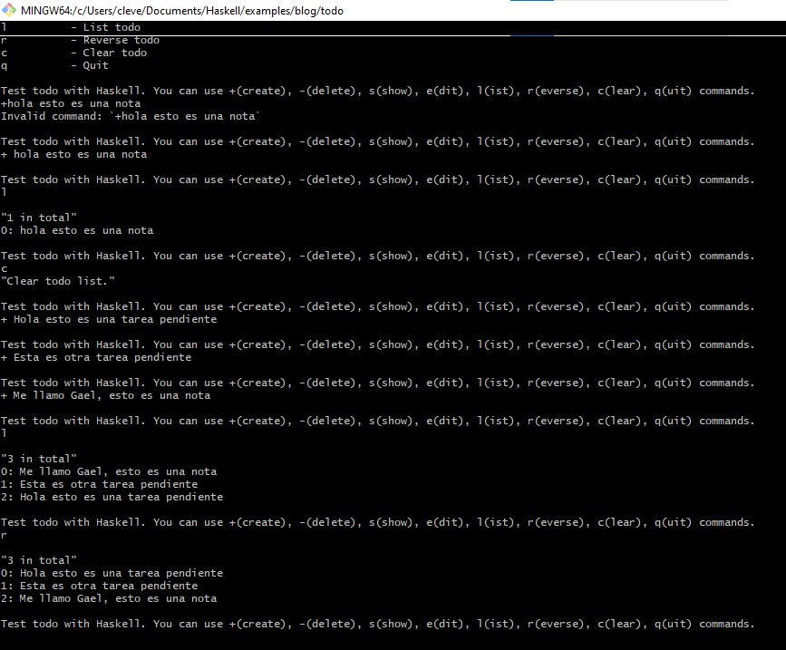

+++
date = '2025-03-12T21:10:19-07:00'
draft = false
title = 'Practica 3: Funcionamiento de una aplicación de Haskell.'
+++

# **Reporte: Funcionamiento de una aplicación de Haskell**

***
* ### **Docente:** Carlos Gallegos
* ### **Materia:** Programación Funcional
* ### **Alumno y Matrícula:** Meza Cruz Gael Alfredo 376163
***

## Introduccion
En este reporte, voy a hablar sobre **Haskell**, un lenguaje de programación funcional. El objetivo de esta práctica es entender y describir el funcionamiento de una aplicación. A lo largo del proceso, voy a aprender como funciona este programa que  trabaja con listas, entradas y salidas de datos, y a utilizar **stack**, que es una herramienta que facilita la compilación y ejecución de proyectos en Haskell.

Para hacer esto, seguí un tutorial online y usé un repositorio de ejemplo para entender cómo interactuar con el programa y gestionar las tareas desde la terminal. 

## ¿Qué hice en esta práctica?

Seguí un tutorial en línea de la página [FP Complete](https://www.fpcomplete.com/haskell/tutorial/stack-script/) que explica cómo usar `stack` para correr scripts de Haskell. También usé un repositorio de ejemplo llamado [steadylearner/Haskell](https://github.com/steadylearner/Haskell/tree/main/examples/blog/todo) para entender mejor cómo se puede interactuar con el sistema y manejar listas desde la terminal.

## Esta aplicación sirve para:

- Practicar los conceptos básicos del lenguaje Haskell.
- Usar comandos de consola para agregar, editar y borrar tareas.

Es un ejemplo útil para aprender cómo manejar entrada/salida, listas, e interacción básica con el usuario.

## ¿Cómo funciona?

El programa principal (`Main.hs`) hace lo siguiente:

1. **Inicia un menú de comandos** donde el usuario puede gestionar una lista de tareas:

   - `+ <texto>`: Agrega una nueva tarea.
   - `- <número>`: Elimina una tarea por su número.
   - `s <número>`: Muestra una tarea específica.
   - `e <número>`: Edita una tarea.
   - `l`: Lista todas las tareas.
   - `r`: Invierte el orden de la lista.
   - `c`: Limpia toda la lista.
   - `q`: Sale del programa.

### 1. **Archivo `spec.hs`**
Este archivo contiene pruebas unitarias para la función `editIndex`. Verifica que, al editar un índice en una lista de tareas, el cambio se realice correctamente. Usa `assert` para comprobar que la función devuelve el resultado esperado.

### 2. **Archivo `main.hs`**
Este archivo maneja la lógica principal de la aplicación de la lista de tareas. Permite interactuar con el usuario a través de la terminal para agregar, eliminar, editar, mostrar y gestionar las tareas. 

Hice algunas pruebas agregando notas y jugando con los comandos disponibles.

